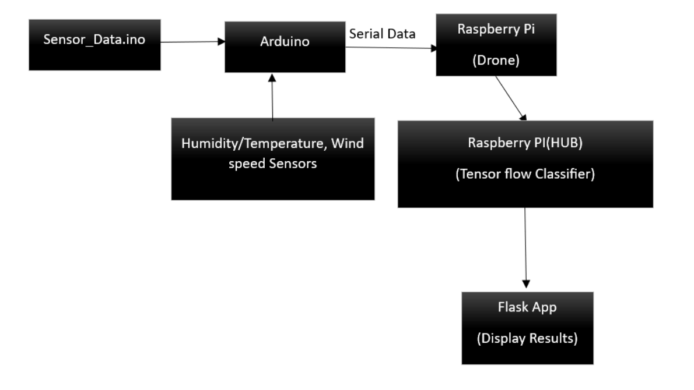
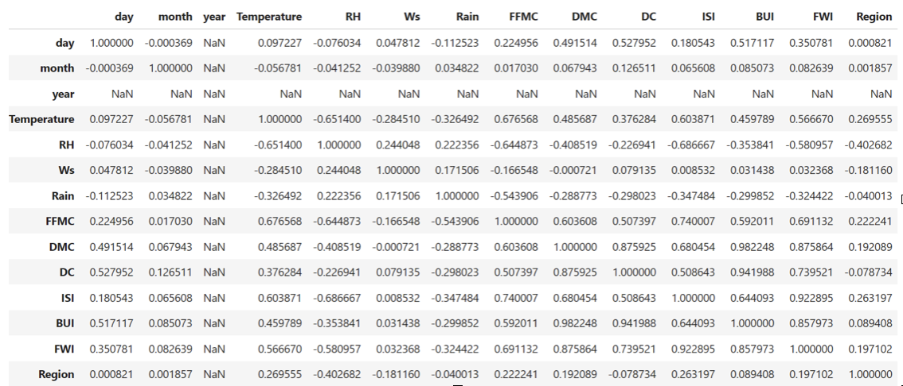
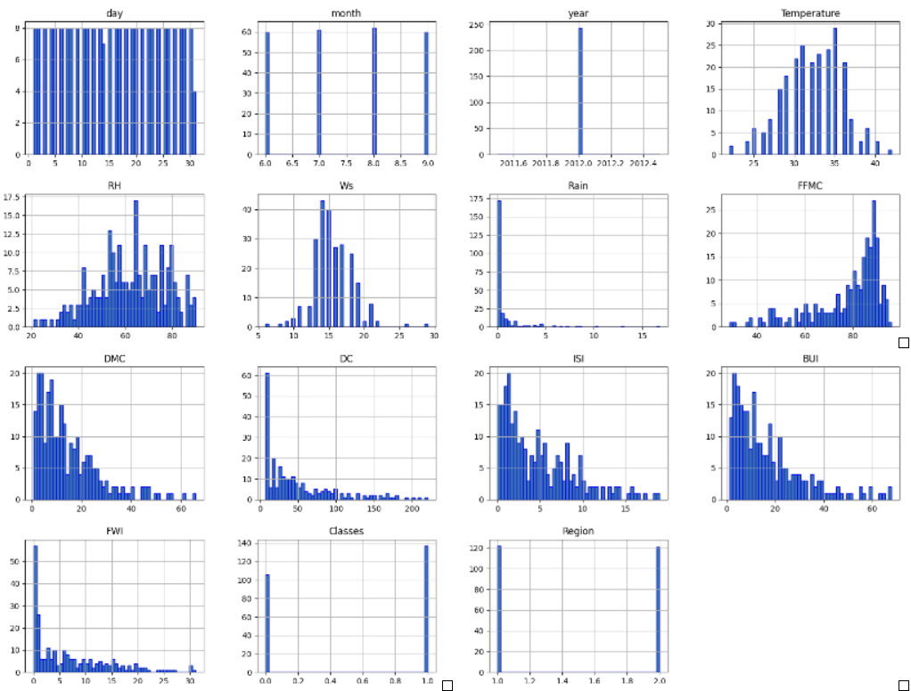
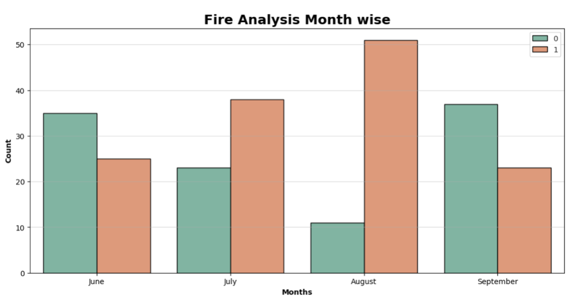

# Code Documentation

# Introduction

The Sensor_Data.ino is the code snippet for the Arduino for collecting the wind. temperature values from their respective sensors. The code is once fed into the Arduino, the sensors start to collect the data from the environment and pass the data serially to raspberry pi in the drone, the raspberry pi in the drone consists of a module “dronetohub”, that receives the serial data from the Arduino and then forwards the data to the raspberry pi in the HUB. In the HUB, we deploy Machine Learning models (Tensor flow classifiers) predict the forest fires based on the data received from the Arduino’s sensor values and then displays the results through a flask APP.  



Figure 1.1. Block Diagram for the flow of the project

# SENSOR_DATA.ino

### Algorithm:

Start
Initialize Serial Communication
Initialize AM2320 Sensor
Set up pin modes for wind and temperature sensors
Enter the Loop:
a. Read Analog values from wind and temperature sensors
b. Perform calculations to convert raw sensor readings to meaningful values (voltage, temperature in Celsius, zero wind adjustment, wind speed in MPH)
c. Print Wind Speed, Temperature (in Fahrenheit), and Humidity to the Serial Monitor
d. Delay for 2500 milliseconds (2.5 seconds)
End

### Libraries Used:

Adafruit_Sensor.h and Adafruit_AM2320.h: Libraries for using the Adafruit AM2320 temperature and humidity sensor.

### Pin Configuration:

- windPin (Analog Pin 7): Used for wind data.
- tempPin (Analog Pin 6): Used for temperature data.

### Variable Declarations:

- TMP_Therm_ADunits: Holds the analog reading from the temperature sensor.
- RV_Wind_ADunits: Holds the analog reading from the wind sensor.
- RV_Wind_Volts: Converts RV_Wind_ADunits to voltage.
- TempCtimes100: Holds the temperature in Celsius multiplied by 100.
- zeroWind_ADunits: Represents the zero wind adjustment based on temperature.
- zeroWind_volts: Converts zeroWind_ADunits to voltage.
- WindSpeed_MPH: Calculates the wind speed in miles per hour.

### Setup Function:

- Initializes Serial communication for monitoring.
- Initializes the AM2320 sensor.
- Sets up pin modes for wind and temperature sensors.

### Loop Function:

- Continuously reads analog values from the wind and temperature sensors.
- Performs calculations to convert raw sensor readings to meaningful values.
- Prints the wind speed, temperature, and humidity to the Serial Monitor.
- Delays for 2.5 seconds.

### Explanation of Loops:

- The code has a single loop() function, which runs repeatedly in a loop. In each iteration of the loop:
- Analog readings are taken from the wind and temperature sensors.
- Calculations are performed to convert these readings to meaningful values.
- The converted values (wind speed, temperature, humidity) are printed to the Serial Monitor.
- A delay of 2.5 seconds (delay (2500)) is introduced before the next iteration of the loop.

# RASPBERRY PI IN THE DRONE (dronetohub.py)

## dronetohub.py code Explanation:

- Open a serial connection for the local device

``` 
ser = serial.Serial("/dev/ttyUSB0", 57600) 
```

This line opens a serial connection for the local device using the serial module. It specifies the port (/dev/ttyUSB0) and baud rate (57600).

- Create an XBee device for communication with the remote device

``` 
xbee = XBeeDevice("/dev/ttyUSB1", 115200) 
```

This line creates an XBeeDevice object for communication with the remote device. It specifies the port (/dev/ttyUSB1) and baud rate (115200).

- Define a function to read data from the local serial port

``` def read_serial_data():
    # Check if there is data in the serial buffer
    if ser.in_waiting > 0:
        try:
            # Read a line from the serial port, decode it, and remove newline characters
            data = ser.readline().decode('utf-8').rstrip()
        except UnicodeDecodeError:
            print("Error decoding data")
        return data
    return None 
```

This function (read_serial_data()) reads data from the local serial port (ser). It checks if there is data in the serial buffer, reads a line, decodes it from bytes to a string using UTF-8, and removes trailing newline characters. It returns the decoded data or None if no data is available.

- Define a function to send data to the remote device

```
def send_data(data):
    # Create a remote device object using the XBee address of the destination device
    remote_device = RemoteXBeeDevice(xbee, XBee64BitAddress.from_hex_string("13A200420107CE"))
    try:
        # Send data asynchronously to the remote device
        xbee.send_data_async(remote_device, data)
    except Exception as e:
        print(f"Error in sending data: {e}")

```

This function (send_data(data)) sends data to the remote device. It creates a RemoteXBeeDevice object using the XBee address of the destination device. It then attempts to send the data asynchronously to the remote device using xbee.send_data_async(). If an exception occurs, it prints an error message.

- Define a function to process received data

```
def process_received_data(received_data):
    # Add your custom processing logic here
    processed_data = received_data.upper()  # Example: Convert to uppercase
    return processed_data

```

This function (process_received_data(received_data)) processes received data. In this example, it converts the received data to uppercase. You can customize this function for your specific processing needs.

- Define a function to log data to a file

```
def log_to_file(data, filename="log.txt"):
    # Open the file in append mode and write the data with a timestamp
    with open(filename, "a") as file:
        file.write(f"{time.ctime()}: {data}\n")

```

This function (log_to_file(data, filename="log.txt")) logs data to a file. It opens the specified file (default is "log.txt") in append mode and writes the data along with a timestamp to the file.


- Try to open the XBee device for communication

```
try:
    xbee.open()
    print("XBee Hub Operational")

    # Enter an infinite loop
    while True:
        # Sending data
        sensor_data = read_serial_data()
        if sensor_data:
            print("Sending data:", sensor_data)
            send_data(sensor_data)

            # Log the sent data to a file
            log_to_file(f"Sent: {sensor_data}")

        # Receiving data
        try:
            # Read data from the XBee module with a timeout of 1 second
            xbee_message = xbee.read_data(1)
            if xbee_message is not None:
                # Decode and print the received data
                received_data = xbee_message.data.decode('utf-8')
                print(f"Received Data: {received_data}")

                # Process received data
                processed_data = process_received_data(received_data)
                print(f"Processed Data: {processed_data}")

                # Log the received and processed data to a file
                log_to_file(f"Received: {received_data}, Processed: {processed_data}")

        except TimeoutException:
            print("No data received within the timeout period.")

```

- Handle keyboard interrupt (Ctrl+C) <br>
```
except KeyboardInterrupt:
    pass
```

- Close the XBee and serial connections when done<br>
```
finally:
    xbee.close()
    ser.close()

```

This block of code attempts to open the XBee device for communication. It then enters an infinite loop where it continuously checks for serial data, sends the data to the remote device, logs it, and prints messages. It also attempts to receive data from the remote XBee device, processes and logs the received data. The program can be interrupted by a keyboard interrupt (Ctrl+C), and it ensures that both the XBee and serial connections are closed properly in the finally block.

# RASPBERRY PI(HUB)(receiving&sending_data_.py)

### imports
- digi.xbee.devices: Provides classes for working with XBee devices.
- time: Allows for time-related operations.
- csv: Enables reading and writing CSV files.
- re: Supports regular expressions for parsing data.
- datetime: Helps in working with dates and times.
- os: Provides a way to interact with the operating system.
- random: Used for generating simulated sensor data.

### variables
- latest_sensor_data Dictionary: Stores the latest sensor data, initially set to None for temperature, humidity, and wind speed.
- remote_xbee Variable: Represents the XBee device for communication with the remote XBee module.
### functions
- parse_and_update_sensor_data(data_str) Function: Parses the received sensor data string and updates the latest_sensor_data dictionary. Extracts temperature, humidity, and wind speed from the data string using regular expressions.
- all_data_collected() Function: Checks if all sensor data (temperature, humidity, wind speed) is collected and not None.
- save_data_to_csv(filename) Function: Saves sensor data to a CSV file. Appends a new row with a timestamp and sensor data to the CSV file.Resets the latest_sensor_data dictionary to None after saving.
- send_data(data) Function: Sends data to the remote XBee device with a specified 64-bit address.Uses asynchronous communication to send data.
- generate_simulated_sensor_data() Function: Generates simulated sensor data for demonstration purposes.Creates a string with random values for temperature, humidity, and wind speed.

### Loops

- Main Loop: Opens the communication with the remote XBee device.Reads data from the remote XBee with a timeout of 2 seconds.Decodes and prints the received data.Parses and updates the latest_sensor_data dictionary.If all sensor data is collected, saves it to a CSV file. Generates simulated sensor data and sends it to the remote XBee. Repeats the loop with a 1-second delay between iterations.Handles exceptions and continues running until interrupted by a keyboard interrupt (Ctrl+C).
- KeyboardInterrupt Handling: Closes the remote XBee connection when the program is interrupted.This script appears to be a part of a system that communicates with a remote XBee device, receives sensor data, processes and stores the data locally in a CSV file, and sends simulated sensor data for demonstration purposes.

```
def parse_and_update_sensor_data(data_str):
    try:
        if "Temperature" in data_str:
            temp_match = re.search(r"Temperature \(F\): ([\d.]+)", data_str)
            if temp_match:
                latest_sensor_data["Temperature"] = float(temp_match.group(1))
        elif "Humidity" in data_str:
            humidity_match = re.search(r"Humidity \(% RH\): ([\d.]+)", data_str)
            if humidity_match:
                latest_sensor_data["Humidity"] = float(humidity_match.group(1))
        elif "Wind Speed" in data_str:
            wind_speed_match = re.search(r"Wind Speed \(mph\): ([\d.]+)", data_str)
            if wind_speed_match:
                latest_sensor_data["Wind Speed"] = float(wind_speed_match.group(1))
    except Exception as e:
        print(f"Error parsing and updating sensor data: {e}")
```

This function takes a string (data_str) as input, typically representing sensor data. It uses regular expressions to extract temperature, humidity, and wind speed values and updates the latest_sensor_data dictionary accordingly. If an error occurs during the parsing process, it prints an error message.


```
def all_data_collected():
    return all(value is not None for value in latest_sensor_data.values())
```

This function checks if all values in the latest_sensor_data dictionary are not None. It returns True if all data is collected and False otherwise.

```
def save_data_to_csv(filename='/home/hub/Desktop/hub/sensor_data.csv'):
    try:
        file_exists = os.path.isfile(filename)
        with open(filename, mode='a', newline='') as file:
            writer = csv.writer(file)
            if not file_exists:
                writer.writerow(['Timestamp', 'Temperature', 'Humidity', 'Wind Speed'])
            current_time = datetime.now().strftime('%Y-%m-%d %H:%M:%S')
            writer.writerow([current_time, latest_sensor_data["Temperature"], latest_sensor_data["Humidity"], latest_sensor_data["Wind Speed"]])
            for key in latest_sensor_data:
                latest_sensor_data[key] = None
    except Exception as e:
        print(f"Error saving data to CSV: {e}")
```

This function saves the sensor data to a CSV file. It checks if the file already exists and creates the file with headers if it doesn't. It then appends a new row with a timestamp and sensor data, resets the latest_sensor_data dictionary to None, and handles any errors that may occur during the file operation.

```

def send_data(data):
    try:
        remote_device = RemoteXBeeDevice(remote_xbee, XBee64BitAddress.from_hex_string("13A20042010691"))
        remote_xbee.send_data_async(remote_device, data)
        print(f"Sent Data to Remote: {data}")
    except Exception as e:
        print(f"Error in sending data to remote: {e}")
```

This function sends data to the remote XBee device. It creates a RemoteXBeeDevice with a specific 64-bit address and uses asynchronous communication to send the data. If an error occurs during the sending process, it prints an error message.

```
def generate_simulated_sensor_data():
    return f"Temperature (F): {random.uniform(60, 80)}, Humidity (% RH): {random.uniform(30, 70)}, Wind Speed (mph): {random.uniform(0, 10)}"
```

This function generates simulated sensor data for demonstration purposes. It creates a string with random values for temperature, humidity, and wind speed.

```
while True:
    try:
        xbee_message = remote_xbee.read_data(2)
        if xbee_message is not None:
            received_data = xbee_message.data.decode('utf-8')
            print(f"Received Data from Remote: {received_data}")
            parse_and_update_sensor_data(received_data)
            if all_data_collected():
                save_data_to_csv()
        simulated_sensor_data = generate_simulated_sensor_data()
        send_data(simulated_sensor_data)
        time.sleep(1)
    except Exception as e:
        print(f"An error occurred: {e}")
```
The main loop continuously reads data from the remote XBee device with a 2-second timeout. It decodes the received data, prints it, updates the latest_sensor_data dictionary, and saves it to a CSV file if all data is collected. Simultaneously, it generates simulated sensor data and sends it to the remote XBee device. The loop sleeps for 1 second between iterations and handles any exceptions that may occur.

```
except KeyboardInterrupt:
    pass
finally:
    try:
        remote_xbee.close()
    except Exception as e:
        print(f"Error closing remote XBee connection: {e}")
```

This block handles a KeyboardInterrupt (Ctrl+C) and ensures that the remote XBee connection is properly closed in the finally block. If an error occurs during the closing process, it prints an error message.

# ForestFirePredictionModel.py

- Load the data into a dataframe

```
df1[['month', 'day', 'year', 'Temperature', 'RH', 'Ws']] = df1[['month', 'day', 'year', 'Temperature', 'RH', 'Ws']].astype(int)
``` 
This line of code converts specific columns in the DataFrame df1 to integer type. The selected columns are 'month', 'day', 'year', 'Temperature', 'RH' (presumably Relative Humidity), and 'Ws' (presumably Wind Speed). The astype(int) method is used for the conversion. This assumes that the values in these columns are currently stored as strings, and the conversion is performed to obtain numeric integer values.

```
objects = [features for features in df1.columns if df1[features].dtypes == 'O']

```
This line of code identifies columns in the DataFrame df1 with a data type of 'object' (which typically represents strings). It uses a list comprehension to iterate through the columns and selects those where the data type is 'O' (object).

```
for i in objects:
    if i != 'Classes':
        df1[i] = df1[i].astype(float)

```

This loop iterates through each column identified as having an 'object' data type, excluding the column named 'Classes'. For each of these columns, it converts the values to float type using astype(float).

```
df1.corr()
```
Checking for the correlation between features: The positive integers away from 0 represent strong correlation, positive/negative integers closer to 0 represent average correlation and negative integers farther from 0 represent worst correlation




```
df1['Classes'] = np.where(df1['Classes'] == 'not fire', 0, 1)
```
This line of code uses the np.where function from the NumPys library to replace values in the 'Classes' column based on a condition. The condition specified is df1['Classes'] == 'not fire'. If the value in the 'Classes' column is equal to 'not fire', it is replaced with 0; otherwise, it is replaced with 1. This essentially converts the 'Classes' column to a binary format where 'not fire' is represented as 0 and any other value as 1.

```
df1.hist(bins=50, figsize=(20,15), ec = 'b')
plt.show()
```
The histograms show the distribution of values for each numerical column in the DataFrame df1.
The shape of each histogram provides insights into the distribution of data. Common distributions include normal (bell-shaped), skewed (left or right), or uniform.





```
# Create a copy of the DataFrame df1 to work with temporarily
dftemp = df1.loc[:]
# Create a figure and axis for the plot with a specified size
plt.subplots(figsize=(13, 6))
# Set the style of the seaborn plot to 'whitegrid'
sns.set_style('whitegrid')
# Create a count plot based on the specified data and columns
sns.countplot(x='month', hue='Classes', data=df1, ec='black', palette='Set2')
# Set the title of the plot
plt.title('Fire Analysis Month wise', fontsize=18, weight='bold')
# Set labels for the y-axis and x-axis
plt.ylabel('Count', weight='bold')
plt.xlabel('Months', weight='bold')
# Display a legend in the upper right corner
plt.legend(loc='upper right')
# Set custom x-axis ticks and labels
plt.xticks(np.arange(4), ['June', 'July', 'August', 'September'])
# Add grid lines to the plot
plt.grid(alpha=0.5, axis='y')
# Show the plot
plt.show()
```

The output of this graph is a count plot showing the distribution of fire incidents month-wise, with each month divided by classes. The legend will indicate the colour corresponding to each class, and the x-axis will represent the months from June to September. The y-axis represents the count of fire incidents. The grid lines add visual guidance to the plot. The analysis can be made based on the height of the bars and their distribution across different months and classes.





```df2 = df1.drop(['day','month','year'], axis=1)
df2.head(10)

df1.drop(['day', 'month', 'year'], axis=1)
```

This part of the code uses the drop method to remove the specified columns ('day', 'month', and 'year') along the columns axis (axis=1). The result is a new DataFrame, and it is assigned to the variable df2.
After executing this code, df2 will contain all the columns from df1 except for 'day', 'month', and 'year'. The head(10) method is then used to display the first 10 rows of the new DataFrame df2.
The resulting DataFrame df2 will have a structure similar to df1, but without the columns 'day', 'month', and 'year'. The purpose of this operation might be to focus the analysis on specific features or to simplify the dataset by removing certain temporal information

```
X = df2.iloc[:, 0:10]
y = df2['Classes']
df2['Classes']
```
This selects the column 'Classes' from the DataFrame, extracting the target variable. The resulting Series is assigned to the variable y.
After executing this code, X will be a DataFrame containing the features (all columns except 'Classes'), and y will be a Series containing the target variable 'Classes'.
This kind of separation is common in machine learning workflows, where X represents the input features and y represents the output (target variable) that the model is trying to predict. In this case, it appears that you are preparing the data for a machine learning model, where you might use the features in X to predict the target variable in y.

```
X_train, X_test, y_train, y_test = train_test_split(X,y,test_size=0.3,random_state=0)
X_train.shape, X_test.shape
train_test_split(X, y, test_size=0.3, random_state=0)
```
This function splits the features X and the target variable y into training and testing sets. The test_size=0.3 parameter indicates that 30% of the data will be used for testing, and the remaining 70% will be used for training. The random_state=0 parameter ensures reproducibility by setting a seed for the random number generator.

- X_train: This variable contains the training set of features.

- X_test: This variable contains the testing set of features.

- y_train: This variable contains the training set of the target variable.

- y_test: This variable contains the testing set of the target variable.

```
def correlation(dataset, threshold):
    # Create an empty set to store correlated column names
    col_corr = set()

    # Calculate the correlation matrix for the given dataset
    corr_matrix = dataset.corr()

    # Iterate over each column in the correlation matrix
    for i in range(len(corr_matrix.columns)):
        # Iterate over each column before the current one
        for j in range(i):
            # Check if the absolute correlation value is above the specified threshold
            if abs(corr_matrix.iloc[i, j]) > threshold:
                # Add the name of the highly correlated column to the set
                colname = corr_matrix.columns[i]
                col_corr.add(colname)

    # Return the set of column names with high correlation
    return col_corr

```
- dataset: This is the input DataFrame for which you want to find highly correlated columns.
- threshold: This is the correlation threshold. Columns with an absolute correlation value greater than this threshold will be considered highly correlated.
- The function does the following:
Initializes an empty set col_corr to store the names of highly correlated columns.
Calculates the correlation matrix (corr_matrix) for the given dataset using the corr method.
Iterates over each column in the correlation matrix using nested loops.
Checks if the absolute value of the correlation between the current pair of columns is above the specified threshold.
If the condition is met, it adds the name of the column with high correlation to the set col_corr.
Finally, it returns the set of column names with high correlation.
This function can be useful for identifying and potentially removing highly correlated features from a dataset, which is a common preprocessing step in machine learning workflows to avoid multicollinearity issues.

```
corr_features = correlation(X_train, 0.8)
```
correlation function to identify highly correlated features in your training set (X_train) with a correlation threshold of 0.8. The variable corr_features will contain the set of column names that exhibit high correlation based on the specified threshold.

```
X_train.drop(corr_features,axis=1, inplace=True)
X_test.drop(corr_features,axis=1, inplace=True)
X_train.shape, X_test.shape

X_train.drop(corr_features, axis=1, inplace=True) 

```

After executing this code, both X_train and X_test will no longer contain the columns identified as highly correlated features. The shapes of the modified DataFrames are printed to show the number of remaining columns in each set.

```
#normalize data using standard scaler
def scaler_standard(X_train, X_test):
    scaler = StandardScaler()
    X_train_scaled = scaler.fit_transform(X_train)
    X_test_scaled = scaler.transform(X_test)
    return X_train_scaled, X_test_scaled
```
- scaler = StandardScaler(): This line creates an instance of the StandardScaler class.
- X_train_scaled = scaler.fit_transform(X_train): This line fits the scaler to the training data (X_train) and then transforms it. - The fit_transform method calculates the mean and standard deviation from the training data and applies the transformation.
- X_test_scaled = scaler.transform(X_test): This line uses the same scaler to transform the testing data (X_test). It's important to use the mean and standard deviation calculated from the training set to ensure consistency. The scaled training and testing sets are then returned from the function.

``` X_train_scaled, X_test_scaled = scaler_standard(X_train, X_test) ```

X_test_scaled should contain the standardized (normalized) versions of your original features using the Standard Scaler.
You can proceed to use these scaled features for training and evaluating your machine learning model. Standardizing features is a common preprocessing step, especially when working with algorithms that are sensitive to the scale of input features, such as those based on distance metrics  or gradient-based optimization.

```
tf.random.set_seed(42)
```
This line sets the seed for the random number generator in TensorFlow to ensure reproducibility.

```
X_train, X_test, y_train, y_test = train_test_split(X, y, test_size=0.2, random_state=42)
```
This line uses the train_test_split function to split the features (X) and labels (y) into training and testing sets. The testing set size is set to 20% of the total data, and the random state is set for reproducibility.


```
model = tf.keras.Sequential([
    tf.keras.layers.Dense(64, activation='relu', input_shape=(X_train.shape[1],)),
    tf.keras.layers.Dense(32, activation='relu'),
    tf.keras.layers.Dense(1, activation='sigmoid')
])
```

This code defines a sequential neural network model using the Keras Sequential API. The model consists of three layers:
The first layer is a Dense layer with 64 neurons, ReLU activation function, and an input shape matching the number of features in the training set.
The second layer is another Dense layer with 32 neurons and ReLU activation.
The third layer is a Dense layer with 1 neuron and a sigmoid activation function, which is typical for binary classification problems

```
#print accuracy of the model
test_loss, test_accuracy = model.evaluate(X_test, y_test)
print(f"Test accuracy: {test_accuracy}")
model.evaluate(X_test, y_test)
```

This line evaluates the trained model on the testing set (X_test) and corresponding labels (y_test). The evaluation returns the test loss and test accuracy.

```test_loss, test_accuracy = model.evaluate(X_test, y_test)```

This line assigns the test loss and test accuracy to the variables test_loss and test_accuracy, respectively.

```
accuracy = accuracy_score(y_test, y_pred)
print(f'\nTest accuracy: {accuracy}')
```
Accuracy turned out to be 90%.

```
model.save('firepredictionmodel.h5')
```
Save the model to import it in the flask application

# FLASK APPLICATION

### FirePredictionTemplate.py

```
interpreter = tf.lite.Interpreter(model_path="/home/hub/Desktop/hub/converted_model.tflite")
```

This line creates an interpreter object and loads the TensorFlow Lite model from the specified path.

```
interpreter.allocate_tensors()
```
This line allocates memory for the model's input and output tensors. After this step, you can set input data, invoke the interpreter, and retrieve the output.

### functions

- index()

This function is invoked by default when the user starts the application.

- Predict_csv()

Defines a route for the '/predict_csv' URL with the HTTP method 'GET'.
Retrieves the uploaded CSV file path and performs predictions using the predict_fire function.
Renders the 'prediction_auto.html' template with the predictions.

- predict_fire()

Opens the CSV file and creates a CSV reader using DictReader to read rows as dictionaries.Extracts temperature, humidity, and wind speed from the row and preprocesses them.
Creates a NumPy array as the input tensor for the TensorFlow Lite model.
Sets the input tensor of the TensorFlow Lite model with the preprocessed input data.
Invokes the TensorFlow Lite model to run inference.
Retrieves the output tensor from the TensorFlow Lite model.
Applies a threshold to the model output to obtain binary predictions (1 or 0).
Prints the model output and appends it to the prediction list.
Re-creates the CSV file with headers after clearing its contents.
Returns the list of binary predictions.
Opens the CSV file in write mode, truncates its contents, effectively clearing it.


### index.html

- This has a button named Predict which invokes predictFire function in the javascript when a user clicks on it.

``` 
<button id="predictButton" onclick="predictFire()">Predict Fire</button>
```
- The script is intended to periodically request predictions for fire incidents from the server using the /predict_csv endpoint.
The results of the prediction are then dynamically updated on the web page without requiring a full page reload.

```
 <script>
        function predictFire(){
        var xhr=new XMLHttpRequest();
        xhr.onreadystatechange=function(){
        if(xhr.readyState==4 && xhr.status ==200){
            document.getElementById("predictionResults").innerHTML=xhr.responseText;
        }
        };
        xhr.open("GET","/predict_csv",true);
        xhr.send();
        }
        setInterval(fetchPrediction,5000);
    </script>```

### prediction_auto.html

-This HTML code is a template and is designed to display the results of forest fire predictions on a webpage.

``` <h1>Forest Fire Prediction Result</h1>
    
    <p>Prediction: FireNo Fire</p>
    
    <a href="/">Go back</a>
```
- It assumes a variable named predictions is available in the template context, containing prediction data.
- For each prediction in the list, it displays whether the prediction indicates "Fire" or "No Fire."
- Users can navigate back to the home page by clicking the "Go back" link.
